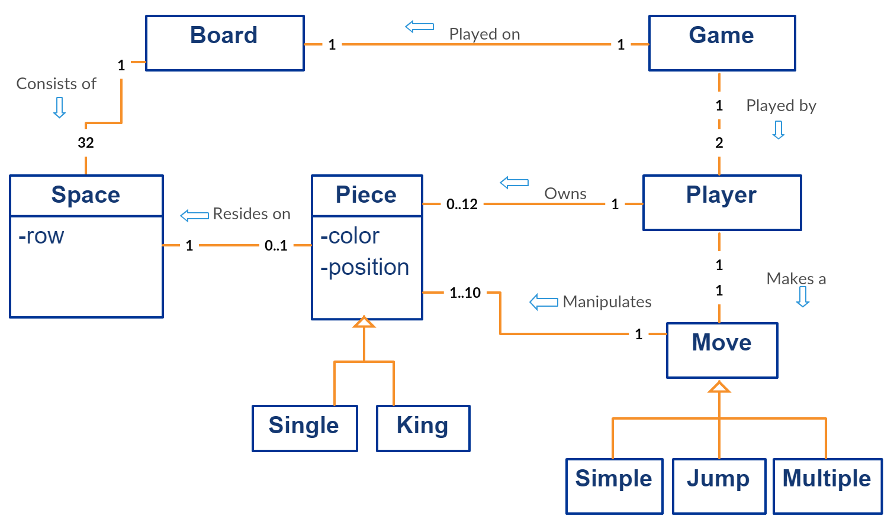
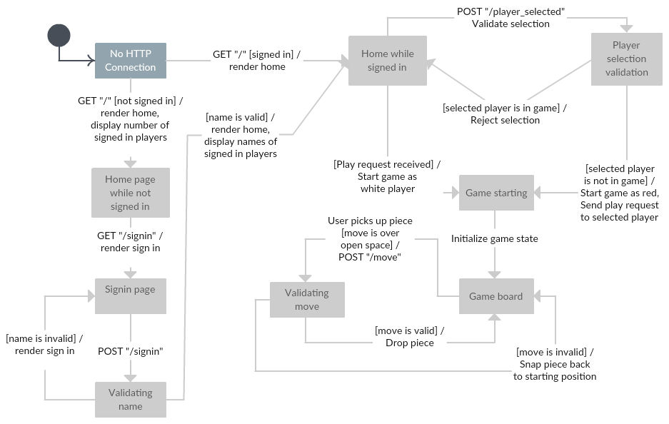
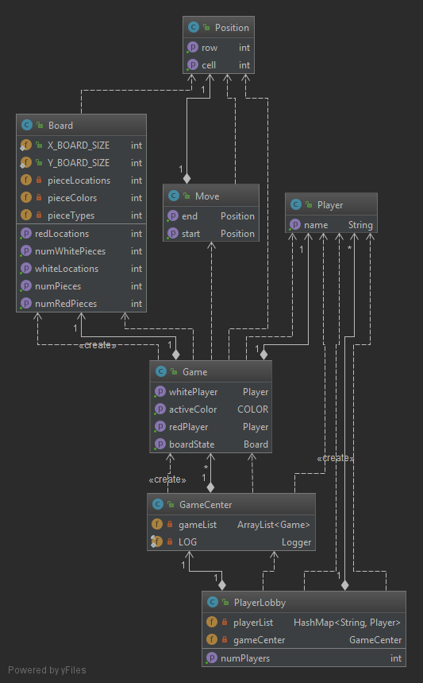
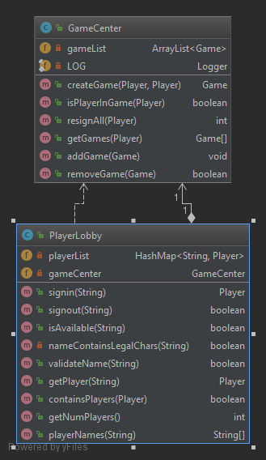
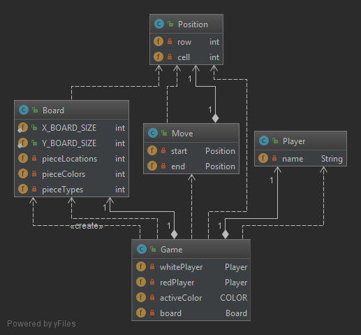
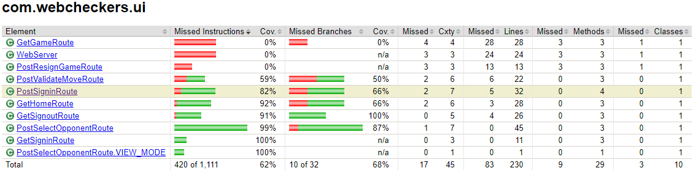
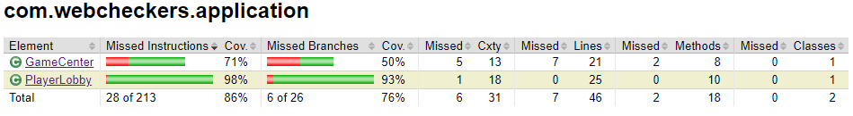
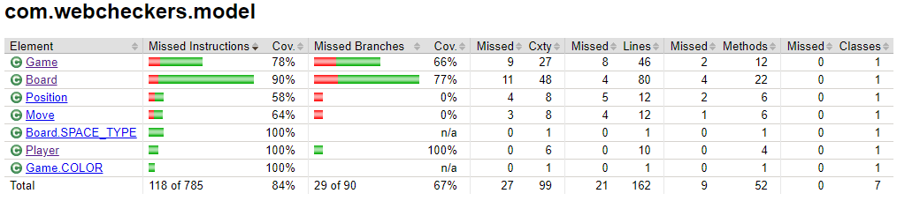


---
geometry: margin=1in
---

# PROJECT Design Documentation

## Team Information
* Team name: 2181-swen-261-10-e-Echo10   
* Team members
  * Meaghan Hoitt
  * Andrew Festa
  * Simon Kirkwood
  * Matthew M.

## Executive Summary

WebCheckers is a web based application that allows multiple users to play against one another in a game of checkers. This vicious game leverages a user’s browser to navigate the application and requires that both players are able to communicate with the host server’s network. Furthermore, the application is intended for use by a general individual with no requirement for advanced understanding of the game. The actual rules governing the ability to move pieces and the progression between turns is enforced. This allows the players to not have to worry about ensuring all moves by either party are legal and makes it such that they free to enjoy the game.

### Purpose
> _Provide a very brief statement about the project and the most
> important user group and user goals._

### Glossary and Acronyms

| Term | Definition |
|------|-------------------------|
| Piece | A regular piece that is only capable of normal move operations |
| King | A piece with elevated rank and move capabilities |
| AI   | Artificial Intelligence |

## Requirements

This section describes the features of the application.

> _In this section you do not need to be exhaustive and list every
> story.  Focus on top-level features from the Vision document and
> maybe Epics and critical Stories._

Upon first landing on the home page, a user is only able to see a count of the number of players currently signed in. However, users are able to sign in using a preferred username, and upon signing in, they are able to see a list of the names of all signed in players. From this list, they are able to select an opponent to play against. Once selecting an opponent to play against, the two players are brought into the game, and thus begins the battle of wits.

### Definition of MVP

At the core, this application allows for a user to play the game of checkers against another player through their web browser. This includes the ability to sign in and reserve a user name, which is the name other users see and are able to select when selecting an opponent. For the actual game of checkers, the rules are based on the [American Rules](http://www.se.rit.edu/~swen-261/projects/WebCheckers/American%20Rules.html "American Rules"). A user is also able to resign from a game at any point. This ends the game and allows both players to move on to another game, if they so desire. Finally, a user may sign out from the web application. In doing so, they release their reservation on their username, and other players may take that name as their own.

### MVP Features

In order to implement the basic features described in the section above, the following Epics and Stories are to be implemented:

- Start of Game
  - [x] Player sign-in
  - [x] Player sign-out
  - [x] Game initialization
- Procession
  - [x] Backup move
  - [ ] Turn Tracking
- Piece Movement
  - [x] Simple move
  - [x] Single-jump move
  - [ ] Multi-jump move
- Resignation
  - [x] User Resigns
  - [x] Opponent Resigns
- Rank Elevation
  - [ ] Piece Promotion
  - [ ] Reverse Movement
- End-of-game Detection
  - [ ] All Pieces Captured
  - [ ] Unable to Move

### Roadmap of Enhancements
> _Provide a list of top-level features in the order you plan to consider them._

***

## Application Domain

This section describes the application domain.

The central aspect to the WebCheckers application domain is the game itself. The Game has two players who interact with each other on opposing sides of the game board. Each player owns either twelve red or twelve white checker pieces. Checker pieces can be of the type single or king: an upgraded version of the single piece with more advanced abilities. A player has the ability to move their pieces in one of three ways. They can make a simple move (sliding their piece diagonally to a new vacant space), a jump (whereby they capture an opponent's piece), or a multiple jump (where they capture more than one of their opponent’s pieces).  The board consists of thirty-two spaces on which each piece resides. Each player takes turns moving their pieces across the board until someone loses all of their pieces and a champion emerges. 

> _Provide a high-level overview of the domain for this application. You
> can discuss the more important domain entities and their relationship
> to each other._

## Architecture and Design

This section describes the application architecture.

### Summary

The following Tiers/Layers model shows a high-level view of the webapp's architecture.

As a web application, the user interacts with the system using a browser.  The client-side of the UI is composed of HTML pages with some minimal CSS for styling the page.  There is also some JavaScript that has been provided to the team by the architect.

The server-side tiers include the UI Tier that is composed of UI Controllers and Views.
Controllers are built using the Spark framework and View are built using the FreeMarker framework.  The Application and Model tiers are built using plain-old Java objects (POJOs).

Details of the components within these tiers are supplied below.

### Overview of User Interface

This section describes the web interface flow; this is how the user views and interacts
with the WebCheckers application.

When the user first hits the home page, they are presented with a screen displaying the number of other player’s who are currently signed in along with a means to sign in themselves. However, they are not able to view the actual names of the signed in players or perform any action other than signing in.
Upon selecting the option to sign in, the user is prompted to enter a username. This username must consist of only alphanumeric characters and spaces, and it must not be in use by another player. If the entered username meets this criteria, the user is brought back to the home page where they are now able to view the name of each signed in player. Each player is selectable and selecting a player attempts to state a game against the selected player.
Starting a game against another player brings both players to the game page. On this page, they are able to interact with the board. In this manner, each player is able to attempt to crush all the hopes and dreams of the other player until only one player reigns supreme. This victory is achieved by either capturing all of the opponent’s pieces, making it such that the opponent cannot make a move, or by shaming the opponent so thoroughly that they resign. Once a game has ended, both players are brought back to the home page with a message describing the manner of the game's end, from where either is able to select to play against any player not currently in a game.

### UI Tier
> _Provide a summary of the Server-side UI tier of your architecture.
> Describe the types of components in the tier and describe their
> responsibilities.  This should be a narrative description, i.e. it has
> a flow or "story line" that the reader can follow._

> _At appropriate places as part of this narrative provide one or more
> static models (UML class structure or object diagrams) with some
> details such as critical attributes and methods._

> _You must also provide any dynamic models, such as statechart and
> sequence diagrams, as is relevant to a particular aspect of the design
> that you are describing.  For example, in WebCheckers you might create
> a sequence diagram of the `POST /validateMove` HTTP request processing
> or you might show a statechart diagram if the Game component uses a
> state machine to manage the game._

> _If a dynamic model, such as a statechart describes a feature that is
> not mostly in this tier and cuts across multiple tiers, you can
> consider placing the narrative description of that feature in a
> separate section for describing significant features. Place this after
> you describe the design of the three tiers._

### Application Tier
> _Provide a summary of the Application tier of your architecture. This
> section will follow the same instructions that are given for the UI
> Tier above._

### Model Tier
> _Provide a summary of the Application tier of your architecture. This
> section will follow the same instructions that are given for the UI
> Tier above._

### Design Improvements
> _Discuss design improvements that you would make if the project were
> to continue. These improvement should be based on your direct
> analysis of where there are problems in the code base which could be
> addressed with design changes, and describe those suggested design
> improvements. After completion of the Code metrics exercise, you
> will also discuss the resulting metric measurements.  Indicate the
> hot spots the metrics identified in your code base, and your
> suggested design improvements to address those hot spots._

## Testing
> _This section will provide information about the testing performed
> and the results of the testing._

### Acceptance Testing

|   Story             |   Completion   | Issues Discovered |
|---------------------|------------------------|-------------------|
| Player sign-in      | 9/9    | None |
| Player sign-out     | 6/6    | None |
| Game initialization | 8/8    | None |
| Turn Tracking       | ?/6    | None |
| Backup Move         | 3/3    | None |
| Simple move         | 2/2    | None |
| Single jump move    | ?/3    | None |
| Multi-jump move     | Not started | N/A |
| User Resigns        | 6/6         | An issue arises when a player is able to be in multiple game at the same time against the same opponent. This is due to not being able to differentiate between two distinct games, as it is expected that the combination of the two players forms a superkey which is able to uniquely identify a game. Thus, a restriction was put in place which limits how many games a player is allowed to be playing at once. |
| Opponent Resigns    | 2/2         | See above |
| Piece Promotion     | Not started | N/A |
| Reverse Movement    | Not started | N/A |
| All Pieces Captured | Not started | N/A |
| Unable to Move      | Not started | N/A |

### Unit Testing and Code Coverage
> _Discuss your unit testing strategy. Report on the code coverage
> achieved from unit testing of the code base. Discuss the team's
> coverage targets, why you selected those values, and how well your
> code coverage met your targets. If there are any anomalies, discuss
> those._

#### UI Tier

Inside of our UI tier there are 10 different classes that need to be tested and only 7 of which that actually were. This left for a lot of gaps in areas of the UI tier that are untested. Additionally, even for the Routes and UI classes that do have corresponding unit tests, these tests tend to test the correct functionality rather than the states in which failure is more likely to happen. For example, most of the classes are not tested for the anamolous scenario when a Player is not stored in the current session, or even if it is, it is not correctly tracked by the PlayerLobby class. It is for this reason, as well as to reduce duplication of effort, that an abstract class was created that intends to implement a base set of unit tests to force each Route into the aforementioned states and to ensure that they are able to crash gracefully or recover.

#### Application Tier

Both of the classes in the application tier tended to be rather complex and contain many branches and flow of execution. The PlayerLobby has near total coverage, while the GameCenter class is lacking in several regards. For GameCenter, this is due to a change in the expected flow of operation as well as the addition of several convenience methods that were not fully tested as they do not contribute as much to the correct operation of the application, as of yet. Still, these are both core and important classes, and as a team, it was decided that both should exceed 95% coverage in order to consider the unit tests complete.

#### Model Tier

For the model tier, most of the classes were well tested enough, as per team decision. The areas of low coverage, namely the Position and Move classes, are simple and while it would be close to trivial to reach perfect coverage and to create unit tests for these classes, this would be more in attempt to reach certain metric goals rather than for gaining any meaningful confidence in the operation of these classes. For the more important classes, namely the Game and Board class, these should be addressed as they drive much of the actual functionality between the actual gameplay of the application. Furthermore, by considering the cyclomatic complexity, it is clear that a large number of entire flows of operation have not been adequately tested, even if the number of tested instruction is relatively high. This is particularly evident in the Board class, and as such, this indicates that a fair number of effort is still required in order to adequately this class.
