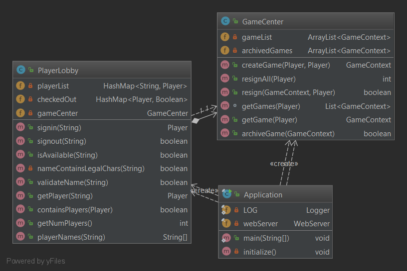

---
geometry: margin=1in
---

# PROJECT Design Documentation

## Team Information
* Team name: 2181-swen-261-10-e-Echo10   
* Team members
  * Meaghan Hoitt
  * Andrew Festa
  * Simon Kirkwood
  * Matthew M.

## Executive Summary

WebCheckers is a web based application that allows multiple users to play against one another in a game of checkers. This vicious game leverages a user’s browser to navigate the application and requires that both players are able to communicate with the host server’s network. Furthermore, the application is intended for use by a general individual with no requirement for advanced understanding of the game. The actual rules governing the ability to move pieces and the progression between turns is enforced. This allows the players to not have to worry about ensuring all moves by either party are legal and makes it such that they free to enjoy the game.

### Purpose
> _Provide a very brief statement about the project and the most
> important user group and user goals._

### Glossary and Acronyms

| Term | Definition |
|------|-------------------------|
| Piece | A regular piece that is only capable of normal move operations |
| King | A piece with elevated rank and move capabilities |
| Artificial Intelligence (AI) | A compuer-based agent that is capable of making rational decisions |
| Heuristic | A calculation aimed towards estimating some end-goal. In this context, it is used interchangeable to describe the features used to evaluate a board state for a particular player. |

## Requirements

This section describes the features of the application.

Upon first landing on the home page, a user is only able to see a count of the number of players currently signed in. However, users are able to sign in using a preferred username, and upon signing in, they are able to see a list of the names of all signed in players. From this list, they are able to select an opponent to play against. Once selecting an opponent to play against, the two players are brought into the game, and thus begins the battle of wits.
At the conclusion of a game, each player is notified of who the winner was and why the game ended. From there, they are free to play against any other player.
This is enhanced by the ability to specify starting conditions beyond a typical game of checkers. These starting configurations are explained in further details in the section covering the roadmap of enhancements.
Another enhancement is the ability to play against various levels of AI. A game is started in the same manner as against a real player with the exception that multiple people may play against the same AI at the same time.

### Definition of MVP

At the core, this application allows for a user to play the game of checkers against another player through their web browser. This includes the ability to sign in and reserve a user name, which is the name other users see and are able to select when selecting an opponent. For the actual game of checkers, the rules are based on the [American Rules](http://www.se.rit.edu/~swen-261/projects/WebCheckers/American%20Rules.html "American Rules"). A user is also able to resign from a game at any point. This ends the game and allows both players to move on to another game, if they so desire. Finally, a user may sign out from the web application. In doing so, they release their reservation on their username, and other players may take that name as their own.

### MVP Features

In order to implement the basic features described in the section above, the following Epics and Stories are to be implemented:

- Start of Game
  - [x] Player sign-in
    
    _As a Player I want to sign-in so that I can play a game of checkers._
    
  - [x] Player sign-out
    
    _As a Player I want to sign-out so I can release my identity._
    
  - [x] Game initialization
    
    _As a Player I want to start a game so that I can play checkers with an opponent._
    
- Procession
  - [x] Backup move
    
    _As a player I want to be able to backup a move before submitting it so that I can recover from my numerous mistakes in life._
    
  - [x] Turn Tracking
    
    _As a Player I want to know when it is my turn so I may go forth and slay my enemy._
    
- Piece Movement
  - [x] Simple move
    
    _As a Player I want to be able to move diagonally forward one space so that I can advance across the board._
    
  - [x] Single-jump move
    
    _As a Player I want to be able to jump over and capture enemy pieces so I may remove them from the board and advance my way towards victory._
    
  - [x] Multi-jump move
    
    _As a Player I want to chain jumps together when possible so that my superior positioning and planning can be rewarded._
    
- Resignation
  - [x] User Resigns
    
    _As a Player I want to resign at any point in time from a game so that I may surrender with what is left of my dignity._
    
  - [x] Opponent Resigns
    
    _As a Player I want to know when my opponent has resigned so I may go defeat another champion._
    
- Rank Elevation
  - [x] Piece Promotion
    
    _As a Player when my piece reaches the far side of the board I want it to be promoted by my opponent to a King piece so that I can obtain a wider range of movement._
    
  - [x] Reverse Movement
    
    _As a Player I want my king piece to have the option to move diagonally backwards (as well as forwards) so that I can flaunt my superior social status._
    
- End-of-game Detection
  - [x] All Pieces Captured
    
    _As a player, I want to know when all of a player's pieces are captured so that I know when the game is over._
    
  - [x] Unable to Move
    
    _As a player, I want to know when a player is unable to move so that I know when the game is over._
    
### Roadmap of Enhancements
- AI
  - [x] Heuristics
    
    _As an AI, I will be able to compute a quality of the current state of the board in order to know how likely I am to win._
    
  - [x] Random AI
    
    _As an AI, I want to make random moves in order to show that I can still beat humans without needing to think._
    
  - [x] Intelligent AI
    
    _As an AI, I will be able to play at the level of a basic human in order to give humanity false hope for the future._
    
- Board Setup Customization
  - [x] Random Boards
    
    _As a player, I want to be able to select to start the game with a set number of pieces randomly placed on each side so that I can practice playing from an unknown start state._
    
  - [x] Preset Boards
    
    _As a player, I want to be able to select the starting board from a set of boards so that I can practice playing from different game states._
    
  - [ ] Custom Boards
    
    _As a player, I want to be able to customize the starting board so that I can fully customize the starting state of the board._
    
    
***

When selecting to play against an AI component, the user is presented with 4 choices:

  - Easy AI
  - Medium AI
  - Hard AI
  - Extreme AI
  
The difference between these choices is in how they decide to make a move.
The Easy AI has no rational decision making process. It simply makes a random move based on the moves it is legally allowed to make.
The other AIs are all implemented using the MiniMax algorithm with the difference being how far ahead they will look in order to evaluate the state of the board. The Medium AI only looks at the next move. The Hard AI looks 3 moves ahead, and the Extreme AI looks an obscene 25 moves ahead, because why not.

***

A user is able to customize the starting conditions of the game. By default, the game will start as a boring, run of the mill game of checkers. However, if the user selects the _Random placement_ button, they are able to specify the number of starting red and white pieces. Upon selecting an opponent, each player then enters the game with that number of pieces randomly distributed on the board.

The third configuration option is to select from one of three preset boards, as depicted below.
  
  
  
  
  
  

The final configuration setting allows the user to fully customize the starting condition by clicking on various positions on the board. If a user selects a valid position on the board, it will place the currently selected color at that position.

This setting is not yet implemented and is intended for future releases.

***

## Application Domain

This section describes the application domain.

The central aspect to the WebCheckers application domain is the game itself. The Game has two players who interact with each other on opposing sides of the game board. Each player owns either twelve red or twelve white checker pieces. Checker pieces can be of the type single or king: an upgraded version of the single piece with more advanced abilities. A player has the ability to move their pieces in one of three ways. They can make a simple move (sliding their piece diagonally to a new vacant space), a jump (whereby they capture an opponent's piece), or a multiple jump (where they capture more than one of their opponent’s pieces).  The board consists of thirty-two spaces on which each piece resides. Each player takes turns moving their pieces across the board until someone loses all of their pieces and a champion emerges. 

## Architecture and Design

This section describes the application architecture.

### Summary

The following Tiers/Layers model shows a high-level view of the webapp's architecture.

As a web application, the user interacts with the system using a browser.  The client-side of the UI is composed of HTML pages with some minimal CSS for styling the page.  There is also some JavaScript that has been provided to the team by the architect.

The server-side tiers include the UI Tier that is composed of UI Controllers and Views.
Controllers are built using the Spark framework and View are built using the FreeMarker framework.  The Application and Model tiers are built using plain-old Java objects (POJOs).

Details of the components within these tiers are supplied below.

### Overview of User Interface

This section describes the web interface flow; this is how the user views and interacts
with the WebCheckers application.

When the user first hits the home page, they are presented with a screen displaying the number of other player’s who are currently signed in along with a means to sign in themselves. However, they are not able to view the actual names of the signed in players or perform any action other than signing in.
Upon selecting the option to sign in, the user is prompted to enter a username. This username must consist of only alphanumeric characters and spaces, and it must not be in use by another player. If the entered username meets this criteria, the user is brought back to the home page where they are now able to view the name of each signed in player. Each player is selectable and selecting a player attempts to state a game against the selected player.
Starting a game against another player brings both players to the game page. On this page, they are able to interact with the board. In this manner, each player is able to attempt to crush all the hopes and dreams of the other player until only one player reigns supreme. This victory is achieved by either capturing all of the opponent’s pieces, making it such that the opponent cannot make a move, or by shaming the opponent so thoroughly that they resign. Once a game has ended, both players are brought back to the home page with a message describing the manner of the game's end, from where either is able to select to play against any player not currently in a game.

### UI Tier
> _Provide a summary of the Server-side UI tier of your architecture.
> Describe the types of components in the tier and describe their
> responsibilities.  This should be a narrative description, i.e. it has
> a flow or "story line" that the reader can follow._

> _At appropriate places as part of this narrative provide one or more
> static models (UML class structure or object diagrams) with some
> details such as critical attributes and methods._

> _You must also provide any dynamic models, such as statechart and
> sequence diagrams, as is relevant to a particular aspect of the design
> that you are describing.  For example, in WebCheckers you might create
> a sequence diagram of the `POST /validateMove` HTTP request processing
> or you might show a statechart diagram if the Game component uses a
> state machine to manage the game._

> _If a dynamic model, such as a statechart describes a feature that is
> not mostly in this tier and cuts across multiple tiers, you can
> consider placing the narrative description of that feature in a
> separate section for describing significant features. Place this after
> you describe the design of the three tiers._

### Application Tier
> _Provide a summary of the Application tier of your architecture. This
> section will follow the same instructions that are given for the UI
> Tier above._

### Model Tier
> _Provide a summary of the Application tier of your architecture. This
> section will follow the same instructions that are given for the UI
> Tier above._

### Design Improvements
> _Discuss design improvements that you would make if the project were
> to continue. These improvement should be based on your direct
> analysis of where there are problems in the code base which could be
> addressed with design changes, and describe those suggested design
> improvements. After completion of the Code metrics exercise, you
> will also discuss the resulting metric measurements.  Indicate the
> hot spots the metrics identified in your code base, and your
> suggested design improvements to address those hot spots._

## Testing
> _This section will provide information about the testing performed
> and the results of the testing._

### Acceptance Testing

|   Story             |   Completion   | Issues Discovered |
|---------------------|------------------------|-------------------|
| Player sign-in      | 9/9    | None |
| Player sign-out     | 6/6    | None |
| Game initialization | 8/8    | None |
| Turn Tracking       | 6/6    | None |
| Backup Move         | 3/3    | None |
| Simple move         | 2/2    | None |
| Single jump move    | 3/3    | None |
| Multi-jump move     | 4/4 | N/A |
| User Resigns        | 6/6         | An issue arises when a player is able to be in multiple game at the same time against the same opponent. This is due to not being able to differentiate between two distinct games, as it is expected that the combination of the two players forms a superkey which is able to uniquely identify a game. Thus, a restriction was put in place which limits how many games a player is allowed to be playing at once. |
| Opponent Resigns    | 2/2         | See above |
| Piece Promotion     | 4/4| Consideration must be made as to which board is altered when changing piece positions or types. |
| Reverse Movement    | 3/3 | None |
| All Pieces Captured | 2/2 | None |
| Unable to Move      | 2/2 | Determining if a player has no more legal moves must occur before the start of their turn. Otherwise, the player will be expected to make a move when they have no valid moves. |

### Unit Testing and Code Coverage
> _Discuss your unit testing strategy. Report on the code coverage
> achieved from unit testing of the code base. Discuss the team's
> coverage targets, why you selected those values, and how well your
> code coverage met your targets. If there are any anomalies, discuss
> those._

#### UI Tier

Inside of our UI tier there are 10 different classes that need to be tested and only 7 of which that actually were. This left for a lot of gaps in areas of the UI tier that are untested. Additionally, even for the Routes and UI classes that do have corresponding unit tests, these tests tend to test the correct functionality rather than the states in which failure is more likely to happen. For example, most of the classes are not tested for the anamolous scenario when a Player is not stored in the current session, or even if it is, it is not correctly tracked by the PlayerLobby class. It is for this reason, as well as to reduce duplication of effort, that an abstract class was created that intends to implement a base set of unit tests to force each Route into the aforementioned states and to ensure that they are able to crash gracefully or recover.

#### Application Tier

Both of the classes in the application tier tended to be rather complex and contain many branches and flow of execution. The PlayerLobby has near total coverage, while the GameCenter class is lacking in several regards. For GameCenter, this is due to a change in the expected flow of operation as well as the addition of several convenience methods that were not fully tested as they do not contribute as much to the correct operation of the application, as of yet. Still, these are both core and important classes, and as a team, it was decided that both should exceed 95% coverage in order to consider the unit tests complete.

#### Model Tier

For the model tier, most of the classes were well tested enough, as per team decision. The areas of low coverage, namely the Position and Move classes, are simple and while it would be close to trivial to reach perfect coverage and to create unit tests for these classes, this would be more in attempt to reach certain metric goals rather than for gaining any meaningful confidence in the operation of these classes. For the more important classes, namely the Game and Board class, these should be addressed as they drive much of the actual functionality between the actual gameplay of the application. Furthermore, by considering the cyclomatic complexity, it is clear that a large number of entire flows of operation have not been adequately tested, even if the number of tested instruction is relatively high. This is particularly evident in the Board class, and as such, this indicates that a fair number of effort is still required in order to adequately this class.
